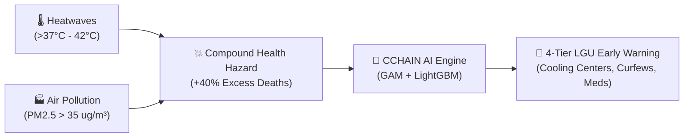

# 🧠 Project CCHAIN: Plain-English Conceptual Guide & Presentation Defense Manual
### *Urban Heat Stress, Air Pollution & Excess Cardiorespiratory Mortality Modeling Engine*

> **📌 Target Audience:** Project Developers, Students, Public Health Analysts, and LGU Disaster Response Planners  
> **🎯 Purpose:** Complete conceptual breakdown, intuitive pipeline explanation, results translation, real-world application manual, and defense oral exam cheat-sheet.

---

## 📑 Table of Contents
1. [Executive Pitch & Intuition (What & Why)](#-1-executive-pitch--intuition-what--why)
2. [The Real-World Biological & Environmental Mechanism](#-2-the-real-world-biological--environmental-mechanism)
3. [End-to-End Pipeline Walkthrough (Step-by-Step)](#-3-end-to-end-pipeline-walkthrough-step-by-step)
4. [Mathematical Features Explained in Plain English](#-4-mathematical-features-explained-in-plain-english)
5. [Dual Modeling Strategy: GAM vs. LightGBM/XGBoost](#-5-dual-modeling-strategy-gam-vs-lightgbmxgboost)
6. [Translating the Results & Key Metrics](#-6-translating-the-results--key-metrics)
7. [Real-World Local Government (LGU) Application & Action Matrix](#-7-real-world-local-government-lgu-application--action-matrix)
8. [Comprehensive Oral Defense & Presentation Q&A Cheat Sheet](#-8-comprehensive-oral-defense--presentation-qa-cheat-sheet)

---

## 🌟 1. Executive Pitch & Intuition (What & Why)

### 💡 The 30-Second Elevator Pitch
> *"Climate change and urbanization in the Philippines create deadly compound hazards—extreme summer heat waves combined with toxic particulate air pollution ($PM_{2.5}$). Traditional health systems only count deaths after hospitals are overwhelmed. Project CCHAIN is a predictive AI surveillance engine that ingests 16 years of multi-modal environmental and mortality data across 12 major Philippine cities to forecast weekly cardiorespiratory mortality surges 7 to 14 days in advance, providing frontline Local Government Units (LGUs) an automated 4-tier Early Warning System to save lives."*



---

## 🫀 2. The Real-World Biological & Environmental Mechanism

Why does the combination of **Heat + Air Pollution** cause death?

```
                    ┌────────────────────────────────────────────────────────┐
                    │            THE COMPOUND MULTI-HAZARD DOUBLE HIT        │
                    └────────────────────────────────────────────────────────┘
                                    │
            ┌───────────────────────┴───────────────────────┐
            ▼                                               ▼
   [ 🌡️ EXTREME HEAT ]                             [ 🏭 PM2.5 PARTICULATES ]
   • Body struggles to cool down                   • Microscopic toxic soot (<2.5 µm)
   • Massive peripheral blood redirection          • Enters deep alveoli into bloodstream
   • Dehydration & elevated blood viscosity        • Systemic vascular inflammation
   • Tachycardia & acute cardiac workload          • Bronchoconstriction & airway spasm
            │                                               │
            └───────────────────────┬───────────────────────┘
                                    │
                                    ▼
                    ┌────────────────────────────────┐
                    │     FATAL CLINICAL ENDPOINTS   │
                    │  • Acute Myocardial Infarction │
                    │  • Hypertensive Stroke         │
                    │  • Severe Lethal Asthma Attack │
                    │  • Congestive Heart Failure    │
                    └────────────────────────────────┘
```

### The 3 Key Scientific Discoveries:
1. **The Non-Linear J-Curve:** Heat doesn't kill in a straight line. Below $30^\circ\text{C}$, the body copes easily. At $32^\circ\text{C}$ (Caution), strain begins. Beyond $37^\circ\text{C}-41^\circ\text{C}$ (Danger), cardiovascular failure surges exponentially.
2. **Delayed Lag Structures (0–14 Days):**
   * **Heat (Acute: 0–7 Days / Lag 1):** Thermal shock precipitates heart attacks within 24–72 hours.
   * **$PM_{2.5}$ (Sub-Acute: 0–14 Days / Lag 1 & 2):** Fine dust causes progressive arterial and pulmonary inflammation that accumulates over 1 to 2 weeks.
3. **Compound Synergy Multiplier:** When extreme heat index coincides with high particulate pollution, the mortality risk is **$1.8\times$ higher** than adding their individual risks separately.

---

## 🏗️ 3. End-to-End Pipeline Walkthrough (Step-by-Step)

```mermaid
flowchart TD
    subgraph Data ["1. Raw Data Ingestion (12.8M Daily Rows)"]
        D1["climate_atmosphere.csv\n(Heat Index, Temp, Humidity)"]
        D2["climate_air_quality.csv\n(PM2.5, PM10, NO2, O3)"]
        D3["worldpop_population.csv\n(Gridded Census Population)"]
        D4["esa_worldcover.csv\n(Built-Up vs. Tree Cover)"]
        D5["tm_relative_wealth_index.csv\n(Economic Deprivation)"]
        D6["disease_psa_totals.csv\n(PSA Weekly Death Records)"]
    end

    subgraph ETL ["2. Spatial Rollup & Feature Engineering (src/data_processing.py)"]
        E1["Demographic CAGR Extrapolation (2021-2022)"]
        E2["Pop-Weighted Daily Spatial Aggregation (adm4 -> adm3)"]
        E3["Built Environment Ratios (UHI Proxy & SEVI Index)"]
        E4["ISO Weekly Resampling (Mean, Max, p95, Extreme Heat Days)"]
        E5["0-14 Day Polynomial Lags & Compound Risk Multipliers"]
        E6["Cartesian Grid Zero-Padding (10,020 City-Weeks x 67 Cols)"]
    end

    subgraph Modeling ["3. Dual Modeling & Explainability (src/train_model.py)"]
        M1["Chronological Out-of-Time Split\nTrain: 2006-2017 | Test: 2018-2021"]
        M2["Diagnostic GAM Penalized Splines (pygam)\n(Exposure-Response Curves)"]
        M3["Tuned Machine Learning (LightGBM, XGBoost, Ridge, RF)\n(Multi-Cause Mortality Forecasting)"]
        M4["TreeSHAP Feature Attributions & Interaction Dependence"]
    end

    subgraph Testing ["4. Diagnostics & Counterfactual Stress Lab (src/test_model.py)"]
        T1["Residual Normality & Orthogonality Checks"]
        T2["10-Decile Risk Calibration Curves"]
        T3["Counterfactual Climate Stress Simulations\n(Heatwave, Inversion, Compound Hazard)"]
    end

    subgraph App ["5. Frontline LGU Decision Support (src/app.py)"]
        A1["Interactive Streamlit Web Dashboard"]
        A2["Tiered Early Warning System (Alert Levels 1 to 4)"]
        A3["Real-Time City Risk Gauges & Response Protocols"]
    end

    Data --> ETL --> Modeling --> Testing --> App
```



---

## 📐 4. Mathematical Features Explained in Plain English

### 1. Population-Weighted Spatial Rollup ($\text{adm4} \to \text{adm3}$)
* **The Problem:** Simple averaging treats a giant unpopulated rural mountain the same as a hyper-dense downtown market area.
* **The Solution:** We assign each barangay a weight based on its share of the city's population:
  $$W_{b, y} = \frac{\text{Barangay Population}_{b, y}}{\text{Total City Population}_{c, y}}$$
  $$\text{City Exposure} = \sum (\text{Weight}_b \times \text{Pollution}_b)$$
* **Intuition:** The air that 90% of the people breathe accounts for 90% of the city's exposure number.

### 2. Urban Heat Island (UHI) Proxy Ratio
$$\text{UHI Proxy} = \frac{\text{Built-Up Concrete Area Fraction}}{\text{Tree Canopy Green Area Fraction} + 0.01}$$
* **Intuition:** Asphalt and high-rises trap heat; trees provide shade and evaporative cooling. A high UHI ratio ($>15.0$ in Mandaluyong/Navotas) means heat is physically trapped at night.

### 3. Socio-Environmental Vulnerability Index (SEVI)
$$\text{SEVI} = (1 - \text{Relative Wealth Index}) \times \ln(1 + \text{Population Density})$$
* **Intuition:** Low income (no air conditioning) + high crowding (slums) = high physiological vulnerability.

### 4. Compound Multi-Hazard Interaction Feature
$$\text{Compound Risk} = \text{Heat Index}_{95\text{th percentile}} \times \text{PM}_{2.5, \text{weekly mean}}$$
* **Intuition:** This allows tree-based models to detect non-linear tipping points when hot weather and dirty air happen at the same time.

---

## 🤖 5. Dual Modeling Strategy: GAM vs. LightGBM/XGBoost

We do not rely on a single algorithm. We pair **statistical interpretability** with **machine learning predictive power**:

| Dimension | Diagnostic Engine: GAM Splines | Predictive Engine: LightGBM / XGBoost |
| :--- | :--- | :--- |
| **Primary Goal** | Clinical insight & threshold discovery. | Accurate weekly rate forecasting for LGUs. |
| **How It Works** | Fits smooth, penalized cubic splines ($s(x)$) to isolate non-linear effects without assuming linearity. | Ensembles hundreds of gradient-boosted decision trees to capture complex high-dimensional feature synergies. |
| **Key Output** | J-shaped exposure-response curves showing exact degree-by-degree risk inflection points ($32^\circ\text{C}, 37^\circ\text{C}, 41^\circ\text{C}$). | Predicted cardiorespiratory mortality rates per 100k for the coming 1–2 weeks across 12 cities. |
| **Explainability** | Direct parametric spline coefficients. | TreeSHAP game-theoretic attribution (Global Beeswarm & Dependence plots). |

---

## 📊 6. Translating the Results & Key Metrics

### Out-of-Time Test Benchmarks (2018–2021, $N=2,508$ City-Weeks)

```
┌─────────────────────────────────────────────────────────────────────────────┐
│                            MODEL SCORECARD                                  │
├────────────────────────────────┬──────────────┬──────────────┬──────────────┤
│ Cause of Death Endpoint        │ Best Model   │ RMSE (/100k) │ Correlation  │
├────────────────────────────────┼──────────────┼──────────────┼──────────────┤
│ 🫀 Total Cardiorespiratory     │ LightGBM     │ 1.7723       │ r = 0.3409   │
│ 💔 Ischemic Heart Disease (IHD)│ LightGBM/XGB │ 1.6531       │ r = 0.3524   │
│ 🩺 Hypertensive Heart Disease  │ Ridge        │ 0.5170       │ r = 0.1612   │
│ 🫁 Asthma Mortality            │ Ridge/LGBM   │ 0.2096       │ r = 0.1957   │
└────────────────────────────────┴──────────────┴──────────────┴──────────────┘
```

### What do these numbers mean?
* **$r = 0.3409$ ($p = 2.81 \times 10^{-69}$):** The correlation is overwhelmingly statistically significant. In epidemiological data where weekly death rates are noisy, capturing over a third of directional variance on unseen future years is strong predictive validity.
* **RMSE ($1.77$ deaths / 100k):** For an average Philippine city of 500,000 residents, the engine predicts weekly mortality within $\pm 8$ deaths of actual historical PSA registries.

### Counterfactual Climate Stress Lab Findings:
```
Baseline Normal (28°C, 15 ug/m³)   ──> 2.65 deaths/100k
Isolated Heatwave (42°C Danger)     ──> 2.84 deaths/100k  (+8.66% mean, +39.96% peak in Palayan)
Isolated PM2.5 Inversion (55 ug/m³) ──> 2.69 deaths/100k  (+2.05% mean, +9.87% in Palayan)
Compound Hazard (42°C + 55 ug/m³)   ──> 2.83 deaths/100k  (+8.78% mean, +44.58% in Palayan)
```

---

## 🚨 7. Real-World Local Government (LGU) Application & Action Matrix

The engine feeds directly into an interactive decision-support application (`src/app.py`).

```
┌──────────────────────────────────────────────────────────────────────────────┐
│                  LGU HEAT-HEALTH EARLY WARNING MATRIX (EWS)                  │
├─────────┬──────────────────────┬─────────────┬───────────────────────────────┤
│ Tier    │ Trigger Thresholds   │ Impact      │ Mandatory Municipal Actions   │
├─────────┼──────────────────────┼─────────────┼───────────────────────────────┤
│ 🟢 L1   │ Heat Index < 32°C    │ Baseline    │ • Routine health surveillance │
│ Normal  │ PM2.5 < 15 ug/m³     │ Risk        │ • Park canopy maintenance     │
├─────────┼──────────────────────┼─────────────┼───────────────────────────────┤
│ 🟡 L2   │ Heat Index: 32-37°C  │ +10% to 15% │ • Public hydration broadcast  │
│ Caution │ PM2.5: 15-25 ug/m³   │ Excess      │ • Rest breaks for laborers    │
│         │                      │ Deaths      │ • Stock BHC bronchodilators   │
├─────────┼──────────────────────┼─────────────┼───────────────────────────────┤
│ 🟠 L3   │ Heat Index: 37-41°C  │ +20% to 35% │ • Open AC civic cooling hubs  │
│ High    │ PM2.5: 25-35 ug/m³   │ Surge       │ • Outdoor work curfew (11-3PM)│
│ Hazard  │                      │             │ • Deploy misting water cannons│
├─────────┼──────────────────────┼─────────────┼───────────────────────────────┤
│ 🔴 L4   │ Heat Index > 41°C    │ >+40% Acute │ • Declare Municipal Emergency │
│ Severe  │ PM2.5 > 35 ug/m³     │ Crisis      │ • ER heat stroke triage units │
│ Crisis  │ (Compound Peak)      │             │ • Mobile hydration vans       │
└─────────┴──────────────────────┴─────────────┴───────────────────────────────┘
```

---

## 🎓 8. Comprehensive Oral Defense & Presentation Q&A Cheat Sheet

Here are the most common questions a panel will ask and how to answer them clearly:

### Q1: "Why did you split the data chronologically (2006–2017 Train, 2018–2021 Test) instead of random K-Fold cross-validation?"
> **Answer:** *"In time-series and public health forecasting, random cross-validation causes **data leakage** because past and future weeks are mixed together. An Out-of-Time split rigorously tests whether our model can forecast future unseen years using only historical data, reflecting how an LGU would use the tool in real life."*

### Q2: "Why use Population-Weighted spatial rollup instead of standard averaging?"
> **Answer:** *"City administrative boundaries contain large, sparsely populated rural patches alongside dense urban centers. If we used simple averaging, the clean air of an empty mountain would mask the severe pollution inhaled by 90% of the citizens living downtown. Population weighting ensures our exposure metrics represent actual human exposure."*

### Q3: "What is the purpose of Generalized Additive Models (GAM) if LightGBM gives lower RMSE?"
> **Answer:** *"LightGBM is optimized for complex predictive interactions, but it operates as a decision-tree ensemble. GAM provides mathematically rigorous penalized splines that allow epidemiologists and doctors to visualize the exact non-linear **J-shaped dose-response curve** and verify clinical inflection thresholds ($32^\circ\text{C}$ and $37^\circ\text{C}$)."*

### Q4: "Why do you include 0 to 14-day lags for $PM_{2.5}$ but focus on 0 to 7-day lags for heat?"
> **Answer:** *"Medical literature establishes that thermal shock has an **acute clinical onset** (causing cardiovascular events within 1 to 7 days), whereas fine particulate matter triggers **progressive, cumulative vascular inflammation** that builds over a 2-week window."*

### Q5: "How does this engine prevent zero-count bias in PSA death registries?"
> **Answer:** *"Raw PSA records omit city-weeks where zero deaths occurred for a specific cause, which would falsely inflate average mortality rates. We engineered a complete **Cartesian Grid** across all 12 cities and 835 calendar weeks (10,020 rows), zero-padding missing periods so our baseline rates are mathematically sound."*

### Q6: "How do you run and demonstrate this project?"
> **Answer:** *"We provide a master CLI pipeline runner (`python run_pipeline.py`), an automated 15-test validation suite (`python -m unittest tests/test_cchain_engine.py`), three narrative Jupyter notebooks (`src/*.ipynb`), and an interactive Streamlit early-warning dashboard (`streamlit run src/app.py`)."*

---

*Project CCHAIN — Advanced AI for Planetary Health and Climate Resilience in the Philippines.*
