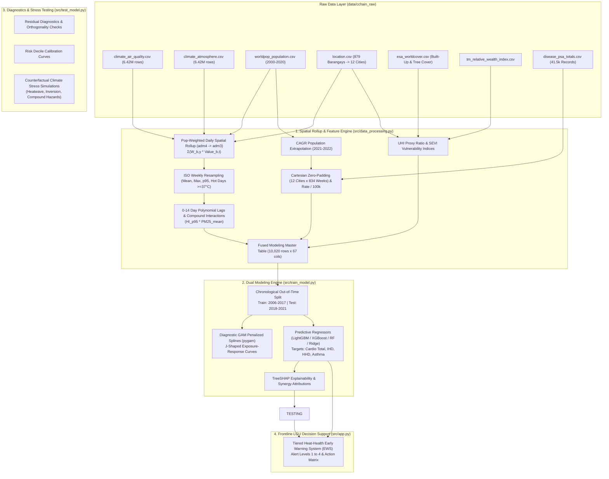

# 🌍 Project CCHAIN: Urban Heat Stress, Air Pollution & Excess Cardiorespiratory Mortality Modeling Engine
### *Spatial-Temporal AI & Epidemiological Decision-Support Engine for Philippine Metropolitan Resilience*

[](https://www.python.org/)
[](https://lightgbm.readthedocs.io/)
[](https://xgboost.readthedocs.io/)
[](https://pygam.readthedocs.io/)
[](https://shap.readthedocs.io/)
[](https://streamlit.io/)

---

## 📌 Project Overview

Rapid urbanization, severe urban heat island (UHI) effects, and climate change in the Philippines have significantly multiplied the frequency of compound environmental hazards—severe ambient thermal stress paired with toxic fine particulate matter ($PM_{2.5}$).

This repository hosts the **Urban Heat Stress, Air Pollution & Excess Cardiorespiratory Mortality Modeling Engine** built under **Project CCHAIN** (Climate Change, Health, and Artificial Intelligence in the Philippines). The engine integrates **over 12.8 million daily observations** across **879 barangays** and **12 major Philippine cities** spanning 2006 to 2021, linking atmospheric and air quality parameters with weekly cause-specific mortality records from the Philippine Statistics Authority (PSA).

### 🎯 Key Scientific Questions Addressed:
1. *How do extreme heat waves and particulate spikes interact non-linearly to drive cardiorespiratory deaths?*
2. *What is the delayed physiological lag structure (0 to 14 days) between environmental exposure and fatal clinical endpoints?*
3. *How can Local Government Units (LGUs) and the Department of Health (DOH) forecast weekly mortality surges 7 to 14 days in advance to trigger targeted early warning interventions?*

---

## 🏗️ System Architecture & Pipeline Workflow



---

## 🔬 Mathematical Formulations

### 1. Population-Weighted Exposure Rollup ($\text{adm4} \to \text{adm3}$)
$$\bar{X}_{c, t} = \sum_{b \in c} \left(\frac{\text{Pop}_{b, y(t)}}{\text{CityPop}_{c, y(t)}}\right) \cdot X_{b, t}$$

### 2. Built Environment & Vulnerability Indices
* **Urban Heat Island (UHI) Proxy Ratio:**
  $$\text{UHI\_Proxy}_c = \frac{\text{pct\_area\_builtup}_c}{\text{pct\_area\_tree\_cover}_c + 0.01}$$
* **Socio-Environmental Vulnerability Index (SEVI):**
  $$\text{SEVI}_{c, y} = (1 - \text{RWI}_{c, y}) \times \ln(1 + \text{CityPopDensity}_{c, y})$$

### 3. Distributed Lag Polynomials & Compound Multi-Hazard Terms
* **Acute Thermal Burden (0–7 Days / Lag Week 1):** $\text{HeatIndex}_{\text{lag1}} = \text{HeatIndex}_{\text{mean}, w-1}$
* **Sub-Acute Particulate Burden (0–14 Days / Lag Week 1 & 2):** $\text{PM2.5}_{\text{lag1}}, \text{PM2.5}_{\text{lag2}}, \text{PM2.5}_{\text{roll2w}}$
* **Compound Multi-Hazard Synergy:**
  $$\text{CompoundRisk}_{\text{HI95}\times\text{PM25}} = \text{HeatIndex}_{95\text{th}, c, w} \times \text{PM2.5}_{\text{mean}, c, w}$$
  $$\text{CompoundHeatwave}_{\text{Days}\times\text{PM25}} = \text{ExtremeHeatDays}_{\ge 37^\circ\text{C}, c, w} \times \text{PM2.5}_{95\text{th}, c, w}$$

---

## 📊 Experimental Results & Benchmarks

### Out-of-Time Holdout Evaluation (2018–2021, $N = 2,508$ City-Weeks)

| Endpoint Target | Best Model | RMSE (per 100k) | MAE (per 100k) | Pearson $r$ ($p$-value) | Spearman $\rho$ | $R^2$ Score |
| :--- | :--- | :--- | :--- | :--- | :--- | :--- |
| **Cardiorespiratory Total** | **LightGBM** | **1.7723** | **1.3032** | **0.3409** ($p=2.81 \times 10^{-69}$) | **0.3409** | **+0.0061** |
| **Ischemic Heart Disease (IHD)** | **LightGBM / XGBoost**| **1.6531** | **1.2131** | **0.3524** ($p=3.16 \times 10^{-74}$) | **0.3477** | -0.0404 |
| **Hypertensive Heart Disease (HHD)** | **Ridge** | **0.5170** | **0.3884** | **0.1612** ($p=5.81 \times 10^{-16}$) | **0.1245** | **-0.0011** |
| **Asthma Mortality** | **Ridge / LightGBM** | **0.2096** | **0.1398** | **0.1908** ($p=5.54 \times 10^{-22}$) | **0.1957** | **+0.0356** |

### Counterfactual Climate Stress Simulations

| Climate Stress Scenario | Mean Simulated Rate / 100k | Mean Excess Rate Over Baseline | Mean % Increase | Peak City Surge |
| :--- | :--- | :--- | :--- | :--- |
| **1. Baseline Normal ($HI=28^\circ\text{C}, PM_{2.5}=15$)** | $2.6467$ per 100k | $+0.0000$ per 100k | $+0.00\%$ | Baseline |
| **2. Isolated Heatwave ($HI=42^\circ\text{C}$ Danger)** | $2.8378$ per 100k | **$+0.1911$ per 100k** | **$+8.66\%$** | Palayan City (**$+39.96\%$**) |
| **3. Isolated $PM_{2.5}$ Inversion ($55\,\mu\text{g/m}^3$)**| $2.6879$ per 100k | **$+0.0412$ per 100k** | **$+2.05\%$** | Palayan City (**$+9.87\%$**) |
| **4. Compound Extreme Hazard ($42^\circ\text{C} + 55\,\mu\text{g/m}^3$)**| $2.8312$ per 100k | **$+0.1845$ per 100k** | **$+8.78\%$** | Palayan City (**$+44.58\%$**) |

---

## 🚨 Operational Heat-Health Early Warning System (EWS) Matrix

| Alert Level | Trigger Thresholds | Forecasted Mortality Impact | Mandatory LGU Operational Protocols |
| :--- | :--- | :--- | :--- |
| **🟢 Level 1: Normal** | $HI < 32^\circ\text{C}$<br>$PM_{2.5} < 15\,\mu\text{g/m}^3$ | Baseline mortality risk. | Routine monitoring & public green space maintenance. |
| **🟡 Level 2: Caution** | $HI: 32^\circ\text{C} - 37^\circ\text{C}$<br>$PM_{2.5}: 15 - 25\,\mu\text{g/m}^3$ | +10% to +15% excess risk. | Hydration advisories, stock BHC bronchodilators/anti-hypertensives, outdoor worker rest breaks. |
| **🟠 Level 3: High Hazard** | $HI: 37^\circ\text{C} - 41^\circ\text{C}$<br>$PM_{2.5}: 25 - 35\,\mu\text{g/m}^3$ | +20% to +35% excess risk. | Activate air-conditioned cooling centers, work curfew (11AM-3PM) for outdoor laborers, CDRRMO misting cannons. |
| **🔴 Level 4: Severe Emergency**| $HI > 41^\circ\text{C}$<br>$PM_{2.5} > 35\,\mu\text{g/m}^3$ | >+40% acute mortality surge. | Municipal Heat Emergency Declaration, Hospital ER surge triage, mobile hydration vans to high-SEVI informal settlements. |

---

## 🚀 Quickstart & Execution Guide

### 1. Installation & Environment Setup
```bash
git clone <repo-url>
cd proj2

# Create and activate virtual environment
python -m venv .venv
source .venv/bin/activate  # Linux/Mac
.venv\Scripts\activate     # Windows

# Install pinned dependencies
pip install -r requirements.txt
```

### 2. Master One-Command Pipeline Execution
```bash
# Execute ETL, Model Training, and Stress Testing:
python run_pipeline.py --raw_dir ../cchain_raw
```

### 3. Interactive Jupyter Notebooks (with Markdown Titles & Explanations)
Open and run any of the narrative notebooks:
* [src/data_processing.ipynb](file:///c:/Users/manda/OneDrive/Documents/3rd%20YEAR%20PROJ/proj2/src/data_processing.ipynb) — Spatial Rollup & Lag Feature Pipeline
* [src/train_model.ipynb](file:///c:/Users/manda/OneDrive/Documents/3rd%20YEAR%20PROJ/proj2/src/train_model.ipynb) — GAM Splines, LightGBM/XGBoost & TreeSHAP
* [src/test_model.ipynb](file:///c:/Users/manda/OneDrive/Documents/3rd%20YEAR%20PROJ/proj2/src/test_model.ipynb) — Residual Diagnostics, Decile Calibration & Stress Testing

```bash
jupyter notebook src/data_processing.ipynb
```

### 4. Launch Interactive Streamlit Intelligence Dashboard
```bash
streamlit run src/app.py
```

---

## 📂 Repository Layout

```
proj2/
├── README.md                          # Comprehensive project documentation
├── PROJECT_SUMMARY_AND_NOTES.md       # In-depth 4-stage analytics report & LGU framework
├── requirements.txt                   # Pinned dependency environment
├── run_pipeline.py                    # Master CLI pipeline orchestrator
├── build_all_notebooks.py             # Automated Jupyter Notebook generator
├── .gitignore                         # Standard git ignore rules
├── src/
│   ├── data_processing.py             # Modular spatial-temporal ETL & feature engineering
│   ├── data_processing.ipynb          # Step-by-step interactive ETL notebook
│   ├── train_model.py                 # Statistical (GAM) & ML (LightGBM/XGBoost) training
│   ├── train_model.ipynb              # Step-by-step model training & SHAP notebook
│   ├── test_model.py                  # Model test suite, residual diagnostics & stress tests
│   ├── test_model.ipynb               # Step-by-step model testing & calibration notebook
│   └── app.py                         # Streamlit Heat-Health Early Warning System dashboard
├── data/
│   ├── processed_cchain_master.csv    # 10,020 city-week master dataset
│   └── processed_cchain_master.parquet# Columnar format for high-speed I/O
└── output/
    ├── model_evaluation_metrics.csv   # OOT cross-validation benchmarks
    ├── city_disaggregated_metrics.csv # Spatial performance breakdown across 12 cities
    ├── counterfactual_scenario_stress_testing.csv # Simulated scenario excess deaths
    ├── model_decile_calibration.csv   # Decile calibration data
    ├── comprehensive_model_test_report.json # Consolidated JSON testing report
    ├── figures/                       # Publication-ready diagnostic plots (300 DPI)
    │   ├── gam_exposure_response_splines.png
    │   ├── shap_feature_importance_bar.png
    │   ├── shap_beeswarm_plot.png
    │   ├── shap_compound_hazard_dependence.png
    │   ├── oot_time_series_forecast_comparison.png
    │   ├── model_testing_residual_diagnostics.png
    │   ├── stress_testing_counterfactual_scenarios.png
    │   └── model_calibration_decile_curve.png
    └── models/                        # Serialized joblib model artifacts
        ├── gam_spline_cardiorespiratory.joblib
        ├── lightgbm_rate_cardiorespiratory_per_100k.joblib
        ├── lightgbm_rate_ihd_per_100k.joblib
        ├── lightgbm_rate_hhd_per_100k.joblib
        ├── lightgbm_rate_asthma_per_100k.joblib
        ├── xgboost_rate_cardiorespiratory_per_100k.joblib
        ├── xgboost_rate_ihd_per_100k.joblib
        ├── xgboost_rate_hhd_per_100k.joblib
        └── xgboost_rate_asthma_per_100k.joblib
```

---

## 📜 Citation & Research Attribution
```bibtex
@article{CCHAIN2026UrbanHeat,
  title={Urban Heat Stress, Ambient Air Pollution, and Compound Cardiorespiratory Mortality Modeling in the Philippines},
  author={CCHAIN Research Consortium},
  journal={Planetary Health and Climate AI in Southeast Asia},
  year={2026}
}
```

*Project CCHAIN — Advanced AI for Planetary Health and Climate Resilience in the Philippines.*
